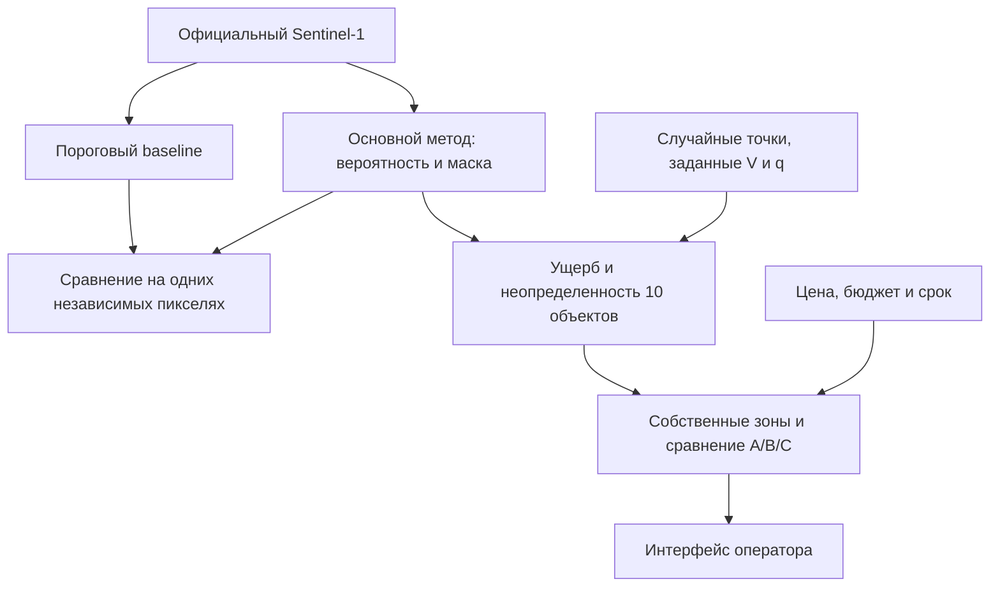

# FloodValue

**ИИ-оценка экономического ущерба от паводка и оптимизация заказа ДЗЗ**

Разработайте решение для оценки последствий паводков, потенциального экономического ущерба и определения территорий, требующих дополнительного наблюдения. Итог представьте в виде веб-сервиса или аналитической панели, позволяющей наглядно оценивать последствия затопления и формировать обоснованный план получения дополнительных данных с учётом доступного бюджета. 

Решение команды и веса моделей публикуются **в GitVerse**, как указано в постановке. Этот репозиторий на GitHub содержит только материалы кейса.

[Правила](docs/CASE_RULES.md) · [Критерии](docs/EVALUATION.md) · [Данные](docs/DATA.md) · [Форматы сдачи](docs/CONTRACTS.md) · [ПП № 840](docs/PRICING_PP840.md) · [Литература](docs/REFERENCES.md)

## Что предстоит сделать

На официальном Sen1Floods11 разработайте пороговый baseline и самостоятельный основной метод. По вероятностям основного метода оцените ожидаемый прямой ущерб и неопределенность для десяти условных объектов на одном выбранном S1-чипе. Создайте собственные зоны дополнительной съемки, сравните стратегии A/B/C и представьте оператору план при объявленном вами бюджете.

Пользователь должен видеть основания выбора и пересчитывать план при изменении бюджета без повторного обучения. Горизонт 6–12 часов описывает целевой процесс после паводка, а не время обучения на хакатоне.

Если постоянная вода не отделена обоснованным способом, результат называется картой воды. Без новых наблюдений эффект дополнительной съемки показывают только как сценарий.

## Начать работу

1. Прочитайте два выданных DOCX и [краткие правила](docs/CASE_RULES.md).
2. Получите нужные S1-файлы и ручные метки из [официального Sen1Floods11](https://github.com/cloudtostreet/Sen1Floods11). Выбор фрагментов и независимое разделение выполняет команда.
3. Посмотрите [вводный ноутбук](notebooks/00_start_here.ipynb): он помогает проверить среду и прочитать метаданные выбранного GeoTIFF.
4. Согласуйте внутри команды [выходные файлы](docs/CONTRACTS.md) и [протокол проверки](docs/VALIDATION.md), затем реализуйте свой проект в GitVerse.

Организатор не предоставляет отдельный архив данных, готовые split, координаты объектов, кандидатные зоны, обученные модели, эталонные предсказания или скрытую выборку. В репозитории есть [таблица заданных типов объектов](data/asset_types.csv) и [пустые формы](examples/empty_submission), без готового портфеля и результатов.

## Навигация по работе

| Задача | Справочные материалы |
|---|---|
| Найти данные и понять метки | [Данные](docs/DATA.md), [научные источники](docs/REFERENCES.md) |
| Подготовить два метода и честное сравнение | [Учебные ресурсы](docs/ML_GUIDE.md), [проверка](docs/VALIDATION.md) |
| Связать вероятность с ущербом | [Экономическая часть](docs/ECONOMICS.md) |
| Сформировать и оценить собственные заказы | [Закупка](docs/PROCUREMENT.md), [геометрия](docs/ORDER_GEOMETRY.md), [тариф](docs/PRICING_PP840.md) |
| Подготовить результат для пользователя и жюри | [Продукт](docs/PRODUCT.md), [форматы](docs/CONTRACTS.md), [критерии](docs/EVALUATION.md) |

Архитектура основного метода, алгоритм выбора зон, среда, интерфейс и оформление защиты остаются за командой. Обязательны пороговый baseline и самостоятельный основной метод; одной смены порога недостаточно. Sentinel-2 и другие открытые бесплатные источники допустимы, но сохраняется рабочий запуск только по S1.

Оценка: **технические критерии № 1–12 — 60 баллов; отраслевые № 13–20 — 40 баллов**. Каждый критерий оценивается от 0 до 5. [Текст утвержденной шкалы](docs/EVALUATION.md).

## Научные ориентиры

Графики ниже воспроизводят опубликованные исследования. Они не задают порог оценки и не являются результатами команды. Методика, исходные числа и ограничения приведены в [пояснениях к графикам](docs/SCIENCE.md).

В обязательном расчете используются фиксированные учебные V/q из постановки. Глубина не выводится из вероятности воды; функции JRC не заменяют заданные коэффициенты.

[Частые вопросы](docs/FAQ.md) · [Литература](docs/REFERENCES.md) · [Условия использования](LICENSE.md) · [Изменения](CHANGELOG.md)

Вопросы о пояснениях можно задать в [Issues](https://github.com/eugenetatarchenkolaw/test_EO/issues). Разъяснения условий организатор сообщает одинаково всем командам.
