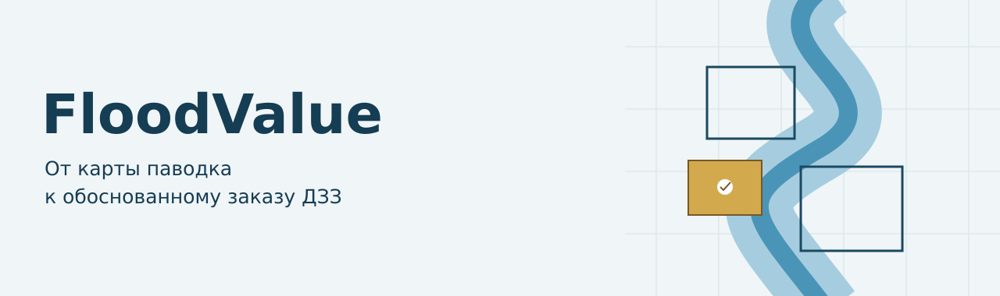
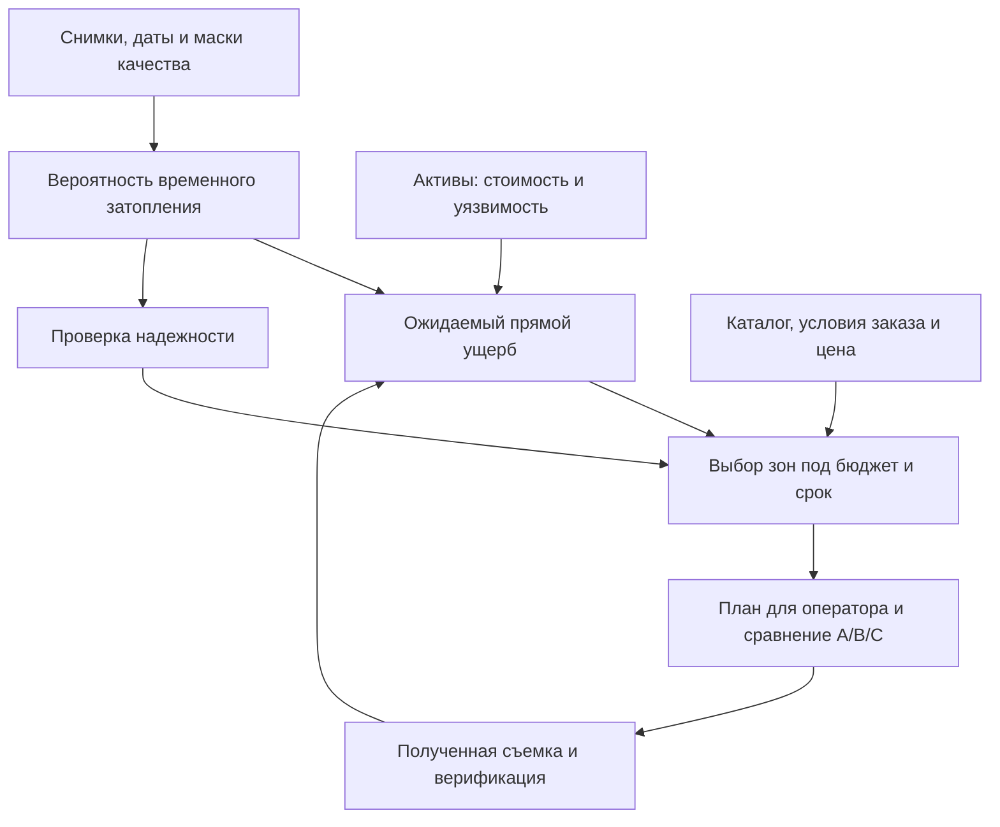
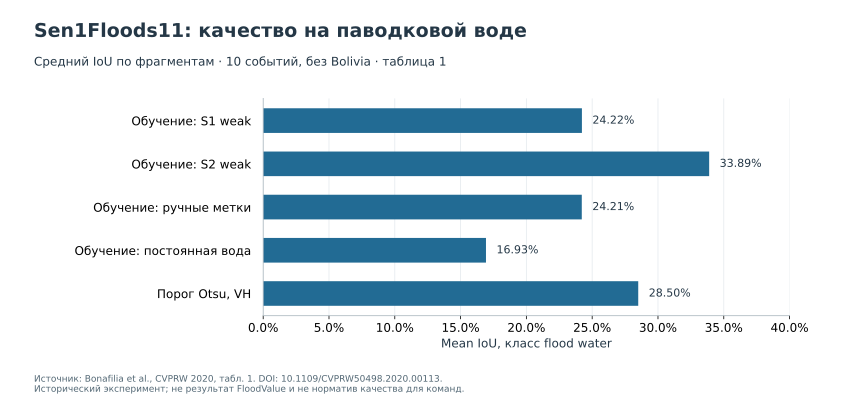
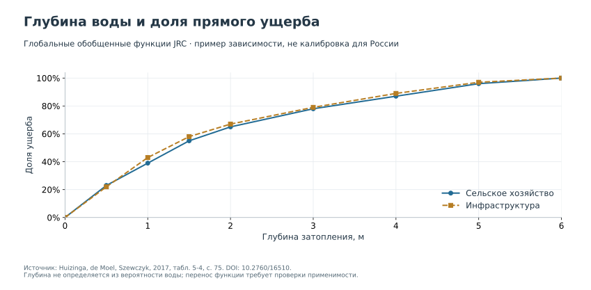

<p align="center"></p>

# FloodValue

**ИИ-оценка экономического ущерба от паводка и оптимизация заказа ДЗЗ**

Учебный репозиторий кейса «КосмоХакатон — 2026». Здесь собраны постановка, источники, форматы обмена и инструменты проверки. Модель, расчет неопределенности, способ выбора съемки и продукт для пользователя разрабатывает команда.

[Начать работу](#начать-работу) · [Правила](docs/CASE_RULES.md) · [Критерии: 100 баллов](docs/EVALUATION.md) · [Данные](docs/DATA.md) · [Стоимость по ПП № 840](docs/PRICING_PP840.md) · [Научные источники](docs/REFERENCES.md)

## Какое решение нужно принять

После крупного паводка у оператора инфраструктуры или страхового аналитического центра есть несколько часов. Нужно понять, каким объектам грозит наибольший прямой ущерб, где оценка ненадежна и какие дополнительные снимки стоит заказать при ограниченном бюджете.

Sentinel-1 помогает наблюдать территорию при облачности. Sentinel-2 добавляет спектральную информацию там, где доступна пригодная оптика. Покупка высокодетальных данных на всю территорию может оказаться слишком дорогой. Но и самый дешевый заказ бесполезен, если он придет после срока принятия решения или охватит уже хорошо изученные участки.

**Результат команды — воспроизводимый прототип, который связывает карту временного затопления, портфель активов, неопределенность и проверяемый план закупки.** Пользователь должен суметь изменить бюджет, пересчитать план и понять причины выбора.



Последняя стрелка — этап после поступления новых наблюдений. Если таких наблюдений в эксперименте нет, улучшение после закупки оценивают как сценарий и прямо это указывают.

## Что здесь готово

| Материал | Что он позволяет сделать |
|---|---|
| [Правила и критерии](docs/CASE_RULES.md) | Увидеть общий минимум и свободу выбора решения |
| [Учебный маршрут](docs/ML_GUIDE.md) | Подготовиться к обучению модели, подобрать подход по ресурсам |
| [Запускаемый вводный Colab](notebooks/00_start_here.ipynb) | Проверить среду, структуру данных и арифметику заказа на CPU |
| [Форматы входов и выходов](docs/CONTRACTS.md) | Согласовать части работы внутри команды и проверить сдачу |
| [Модуль цены](tools/pp840_helper.py) | Пересчитать переданный набор заказов; он не выбирает заказы |
| [Проверка результатов](tools/validate_submission.py) | Найти ошибки в таблицах, растрах, бюджете и итогах |
| [Исследовательский разбор](docs/SCIENCE.md) | Связать методы с опубликованными данными и их ограничениями |
| [Графики и исходные числа](data/evidence) | Проверить каждое опубликованное сравнение |

**Статус данных.** В этой версии есть небольшой синтетический набор для проверки интерфейсов и арифметики. Конкурсные снимки, разметка и реальный каталог заказов не вложены. До старта организатор выпускает отдельный архив по [регламенту подготовки данных](docs/DATA_RELEASE.md), с контрольными суммами и зафиксированным разделением. Учебный набор не пригоден для обучения или оценки качества FloodValue. Закрытое решение жюри в репозитории отсутствует.

## Начать работу

### Без установки: Google Colab

[](https://colab.research.google.com/github/eugenetatarchenkolaw/test_EO/blob/main/notebooks/00_start_here.ipynb)

Выполните ячейки сверху вниз. Вводный ноутбук работает на CPU, не требует коммерческого аккаунта и не скачивает гигабайты снимков. Он проверяет подготовку к работе; обучение и итоговое решение остаются задачей команды. После выпуска конкурсного архива используйте его локальный путь.

### Локально: Python 3.12

```bash
git clone https://github.com/eugenetatarchenkolaw/test_EO.git
cd test_EO
python -m unittest discover -s tests -v
python -m tools.audit_data --data data/demo
python -m tools.pp840_helper --data data/demo --ids DEMO_O1 DEMO_O2
```

Эти команды используют стандартную библиотеку Python. Для проверки GeoTIFF и запуска ноутбука установите дополнительные зависимости:

```bash
python -m pip install -r requirements.txt
python -m tools.validate_submission --data data/competition --submission outputs/team
```

Папка `outputs/team` создается вашим решением. [Пустые таблицы](examples/empty_submission) показывают заголовки и намеренно не проходят полную приемку. В репозитории нет готовых прогнозов и «правильного» набора покупок.

## Маршрут команды

| Шаг | Вопрос, на который нужно ответить | Где искать помощь |
|---|---|---|
| 1. Данные | Что наблюдал спутник, что означает метка и где нет данных? | [Данные](docs/DATA.md) |
| 2. Простой ориентир | Какое качество дает объяснимое правило или простая модель? | [Обучение](docs/ML_GUIDE.md) |
| 3. Основной подход | Что улучшилось на новом событии и за счет чего? | [Протокол проверки](docs/VALIDATION.md) |
| 4. Экономика | Как вероятность переходит в рубли и насколько они надежны? | [Ущерб и неопределенность](docs/ECONOMICS.md) |
| 5. Заказ | Что купить, когда это будет доступно и какова полная цена? | [Закупка](docs/PROCUREMENT.md), [тариф](docs/PRICING_PP840.md) |
| 6. Продукт | Как оператор использует вывод в течение 6–12 часов? | [Продукт и защита](docs/PRODUCT.md) |

Команда сама распределяет время. Можно начать с S1 и классического ML, затем добавить оптику; можно сразу исследовать сегментационную сеть. Число моделей и сложность архитектуры сами по себе баллов не дают.

## Общий минимум и пространство выбора

| Обязательно для всех | Команда выбирает |
|---|---|
| Разделение по событиям и географии, без утечки | Пороговый подход, классический ML, U-Net, DeepLab, SegFormer, ансамбль или гибрид |
| Вероятность и бинарная маска временного затопления | Каналы, признаки, функция потерь, калибровка и обработка границ |
| Проверяемый прямой ущерб и неопределенность | Дополнительные экономические сценарии и способ объяснения риска |
| Один каталог, одна арифметика цены, соблюдение бюджета | Алгоритм поиска и ограничения на важные объекты |
| Сравнение A: открытые данные; B: широкая закупка; C: выборочная закупка | Карта, отчет, панель, GIS-плагин, API или другой понятный интерфейс |
| Фиксированные файлы и воспроизводимость | Среда запуска, дизайн, структура выступления и записки |

## Что показывает научная литература

В Sen1Floods11 опубликованы 4 831 фрагмент 512 × 512 пикселей по 11 событиям; ручная разметка есть у 446 фрагментов. Ручные и автоматически полученные метки нельзя считать равноценными. Кроме того, метка воды во время паводка сама по себе не отделяет временное затопление от постоянных водоемов. [Данные и статья авторов](https://github.com/cloudtostreet/Sen1Floods11).



Это результаты опубликованного эксперимента, а не ориентир баллов на хакатоне. Метрика на временной воде, протокол разбиения и состав событий важнее громкого процента «точности». [Числа и оговорки](docs/SCIENCE.md#данные-для-графиков).

Оценка ущерба требует отдельных предположений о стоимости и уязвимости. В методике JRC доля повреждения зависит от глубины и категории актива. Вероятность воды на снимке не сообщает глубину затопления. [Huizinga, de Moel, Szewczyk, 2017](https://publications.jrc.ec.europa.eu/repository/handle/JRC105688).



## Что передать жюри

1. `flood_probability.tif` и `flood_mask.tif`; для нескольких зон — такие файлы внутри каждой зоны и общий `raster_manifest.csv`.
2. `asset_loss.csv`: вероятность, прямой ожидаемый ущерб, неопределенность, приоритет и полнота наблюдения.
3. `procurement_plan.csv`: выбранные позиции, площадь, коэффициенты и проверяемая стоимость.
4. `strategy_comparison.csv`, `strategy_plans.json` и `sensitivity.csv`: три стратегии и чувствительность вывода.
5. Карта или иной интерфейс приоритетов, исходный код, конфигурация и инструкция запуска.
6. Презентация с ограничениями и планом внедрения. Ее дизайн, число слайдов и сюжет не заданы.

Полный состав — в [контракте результатов](docs/CONTRACTS.md). Шкала: 20 критериев по 0–5, максимум 100. [Оригинальные формулировки критериев](docs/EVALUATION.md) сохранены; пояснения вынесены отдельно.

## Границы применения

Пилотный ориентир: одно событие, 5–15 тыс. км² и до нескольких десятков тысяч объектов или ячеек. Это целевой масштаб проекта, а не площадь учебных фрагментов. Операционный срок 6–12 часов включает получение и подготовку доступных данных, расчет и проверку человеком. Новая съемка не гарантированно приходит за это время.

Расчет относится к одному событию и прямому ущербу заданного портфеля. Он не является годовым ожидаемым ущербом, суммой страхового возмещения или официальной оценкой. Покупка данных сама по себе не предотвращает физические потери. [Как показать экономический эффект корректно](docs/ECONOMICS.md).

Нормативная контрольная дата — **20.09.2026**. Используется ПП РФ № 840 в редакции от **27.08.2025**. Числовая ставка БРЕ в учебном примере — **сценарное допущение**, не объявленный действующий тариф. Перед конкурсом организатор проверяет редакцию и фиксирует входы цены. [Источники и порядок расчета](docs/PRICING_PP840.md).

## Навигация и условия использования

[FAQ](docs/FAQ.md) · [Исправления методических неточностей](docs/METHODOLOGICAL_NOTES.md) · [Список литературы](docs/REFERENCES.md) · [Лицензии](LICENSE.md) · [История версии](CHANGELOG.md)

Исходная организационная модель — [кейс test_oil](https://github.com/SpaceEconomyPolicy/test_oil). Научная постановка, материалы и инструменты FloodValue разработаны для задачи паводкового ущерба и закупки ДЗЗ. Вопросы о данных и правилах направляйте в [Issues](https://github.com/eugenetatarchenkolaw/test_EO/issues); не прикладывайте скрытую разметку, токены или персональные данные.
