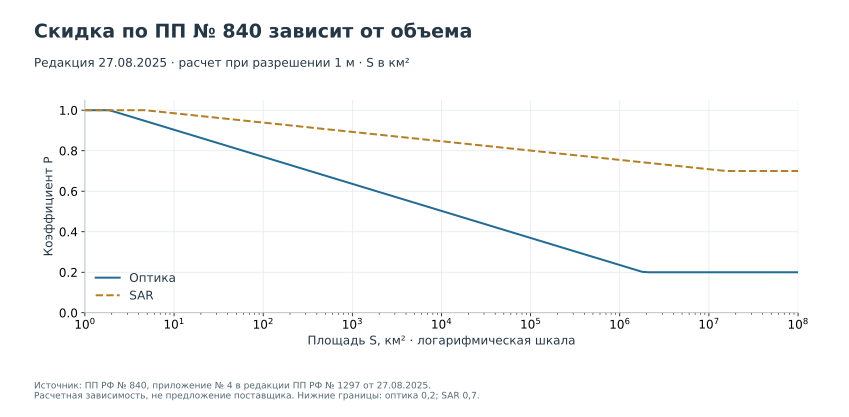

# Как проверить стоимость по ПП РФ № 840

Контрольная дата: **20 сентября 2026 года**. Постановление Правительства РФ от 29.06.2019 № 840 применяется в редакции от **27.08.2025**. Изменения внесены ПП РФ № 1297. Приложенная первоначальная редакция 2019 года не подходит для этого расчета: состав коэффициентов изменился.

## Источники и границы проверки

| Документ | Роль | Источник |
|---|---|---|
| ПП РФ № 840 от 29.06.2019 | Основные правила расчета платы | [Официальная публикация](https://publication.pravo.gov.ru/Document/View/0001201907020012) |
| ПП РФ № 1297 от 27.08.2025 | Изменения действующей формулы и коэффициентов | [Официальная публикация](https://publication.pravo.gov.ru/document/0001202508290066) |
| ПП РФ № 840, ред. 27.08.2025 | Удобный сводный текст для сверки | [КонсультантПлюс](https://www.consultant.ru/document/cons_doc_LAW_328023/), [полный текст с формулами](https://meganorm.ru/mega_doc/dop1/97/zakon_rf_ot_20_08_1993_N_5663-1_red_ot_29_12_2025_o/0/postanovlenie_pravitelstva_rf_ot_29_06_2019_N_840_red_ot_27.html) |
| Приказ ГК «Роскосмос» № 116 от 21.05.2026 | Методика определения стоимости БРЕ; зарегистрирован 26.06.2026 № 87243 | [Официальная публикация](https://publication.pravo.gov.ru/document/0001202606260063) |

Официальные карточки документов идентифицированы; при подготовке репозитория доступ к загрузке части официальных публикаций был нестабилен. Формулы и таблицы сверены по доступному сводному тексту, включая изображения формул. Перед выпуском конкурсного каталога организатор сохраняет официальные документы, повторно проверяет редакцию и утверждает входы. Доступный сводный текст не объявляется официальной публикацией.

Приказ о методике БРЕ не равнозначен универсальному числу рублей за км². В учебных примерах **788,64 руб./км² — сценарная ставка**. Подтвержденный действующий размер БРЕ в предоставленных материалах не установлен. Поле `base_rate_status=scenario` должно сохраняться в расчетах и подписях; заменить его на `official` можно только вместе с проверяемым источником конкретной ставки.

## Формула

$$
\mathrm{РП}=Б\times К\times О\times П\times Т\times Р.
$$

| Обозначение | Значение | Поле в коде |
|---|---|---|
| Б | Стоимость одной базовой расчетной единицы, руб. | `base_rate_rub_km2` |
| К | Число БРЕ; одна БРЕ соответствует 1 км² | `area_km2` |
| О | Коэффициент уровня обработки | `processing_coef` |
| П | Коэффициент условий использования | `usage_coef` |
| Т | Коэффициент актуальности / новой съемки | `freshness_coef` |
| Р | Коэффициент скидки за объем | `discount_coef` |

В нормативной формуле скидки латинская буква R означает пространственное разрешение. Чтобы не путать ее с кириллической Р в цене, код использует отдельное имя `resolution_m`.

### Уровень обработки О

| Категория в Правилах | О |
|---|---:|
| L0 | 1 |
| L1 | 1 |
| L2 | 1,2 |

Уровень в коммерческом предложении сопоставляет с Правилами поставщик/организатор. Название продукта Sentinel-2 L2A не является автоматическим основанием поставить О = 1,2 для другого заказываемого продукта.

### Условия использования П

| Режим | П | Значение в CSV |
|---|---:|---|
| Внутреннее использование без передачи третьим лицам | 1 | `internal` |
| Ограниченное безвозмездное распространение | 1,2 | `limited` |
| Неограниченное распространение, в том числе коммерческое и размещение в интернете | 1,5 | `unrestricted` |

Это краткие обозначения; условия договора должны соответствовать полному тексту Правил. Особый порядок для органов государственной власти проверяется отдельно. Страховой центр, подрядчик или компания с государственным участием не получает такой статус автоматически. Публичный экран с производными результатами и распространение исходного снимка могут иметь разные условия — команда фиксирует, что именно передается.

### Актуальность Т

| Заказ | Т | Значение в CSV |
|---|---:|---|
| Новая съемка с гарантированной покупкой | 1,8 | `new`, `guaranteed_purchase=true` |
| Имеющиеся данные, полученные не более 90 календарных дней назад | 1 | `operational` |
| Имеющиеся данные старше 90 календарных дней | 0,6 | `archive` |

На границе **ровно 90 дней применяется 1**. Давность считают на дату расчета по дате получения снимка. Облачность не заменяет Т. Коэффициент 1,8 относится к условию новой гарантированной покупки, а не к гарантии поставки в течение нескольких часов.

### Скидка Р

Для оптико-электронных материалов:

$$
Р_{opt}=\min\{1,\max[0{,}2;\;-0{,}058\ln(S/r^2)+1{,}037]\}.
$$

Для радиолокационных материалов:

$$
Р_{SAR}=\min\{1,\max[0{,}7;\;-0{,}020\ln(S/r^2)+1{,}031]\}.
$$

Здесь S — площадь в км², r — разрешение в метрах; натуральный логарифм. Формула использует числовые значения именно в этих нормативно заданных единицах. Самовольный перевод S в м² меняет тариф. Неположительные S и r недопустимы. Площадь учитывается в пределах календарного года с 1 января по 31 декабря.



График построен по формуле при r = 1 м. Он не показывает действующую стоимость БРЕ и не доказывает экономическую полезность более крупного заказа.

## Что является правилом учебного расчета

Нормативный текст и перечисленные ниже соглашения имеют разный статус.

1. Базовый пользователь — частный коммерческий оператор. Проверочный модуль не определяет право на бесплатное предоставление. В Правилах есть особые случаи для органов власти, включая пороги **свыше** 1 м для оптики и **свыше** 10 м для SAR; равенство порогу не означает «свыше». Применимость бесплатного режима, в том числе по связанным актам, требует отдельного основания. Нулевая ставка допустима во входах только с `zero_rate_basis`.
2. В демонстрационном каталоге группы скидки однородны по типу данных и разрешению. Организатор заранее задает `discount_group_id` и площадь предыдущих заказов того же календарного года. Для расчета S складываются площадь выбранных позиций группы и эта ранее заказанная площадь. Предыдущие счета задним числом не пересчитываются. Это **соглашение кейса для смешанного каталога**, а не дополнительно установленная здесь правовая норма. В реальном заказе группировку подтверждают условия поставщика.
3. Площадь каждой позиции уже приведена к 0,001 км². Скидка округляется до 9 знаков; цена за км² — до копеек; стоимость позиции — до копеек. Используется `ROUND_HALF_UP`. Итог — сумма стоимостей позиций. Это **конвенция проверочного модуля**, а не заявленное требование ПП № 840. При другом правиле счета организатор обновляет модуль и контрольные примеры до старта.
4. Каталог описывает отдельные оплачиваемые позиции. Пересечение их геометрий не уменьшает оплачиваемую площадь само по себе. Полезное покрытие пересечений считается один раз.
5. НДС, специальная обработка, доставка, интеграция и труд аналитика не возникают в модуле автоматически. Если их нужно учитывать, указываются основание, база и отдельные статьи полной стоимости решения. Нельзя незаметно умножить тариф на произвольную «надбавку».

Если организатор получает фиксированные подтвержденные котировки вместо расчета объема корзины, нужен отдельно объявленный режим каталога и проверяющий модуль. Смешивать фиксированные цены одних стратегий с объемным расчетом других нельзя.

## Контрольный пример без логарифмической скидки

Сценарий: Б = 788,64 руб./км²; К = 1,000 км²; оптика 1 м; S = 1,000 км²; L2; внутреннее использование; новая гарантированная покупка.

Р = min(1; max(0,2; 1,037)) = 1. Цена за км² до округления: 788,64 × 1,2 × 1 × 1,8 × 1 = **1 703,4624 руб.** После принятого округления: **1 703,46 руб.** Стоимость позиции: **1 703,46 руб.** Для оперативного снимка при остальных тех же условиях — **946,37 руб.**, архивного старше 90 дней — **567,82 руб.** Это арифметические примеры со сценарной Б.

```bash
python -m tools.pp840_helper --data data/demo --ids DEMO_O1
python -m tools.pp840_helper --data data/demo --ids DEMO_O1 DEMO_O2 --output outputs/check_price.csv
```

Модуль возвращает стоимость указанной корзины и признак бюджета, не рекомендуя покупку. При добавлении позиции S меняется; пересчитывать нужно **всю корзину**. Это существенно для алгоритма закупки: цены, рассчитанные один раз для одиночных позиций, могут не совпасть с итоговым счетом.

Перед сдачей сохраните исходные строки каталога, конфигурацию, редакцию, дату, группы скидки, основания Б и округление. Жюри должно воспроизвести каждый множитель без поиска скрытых констант в ноутбуке.
