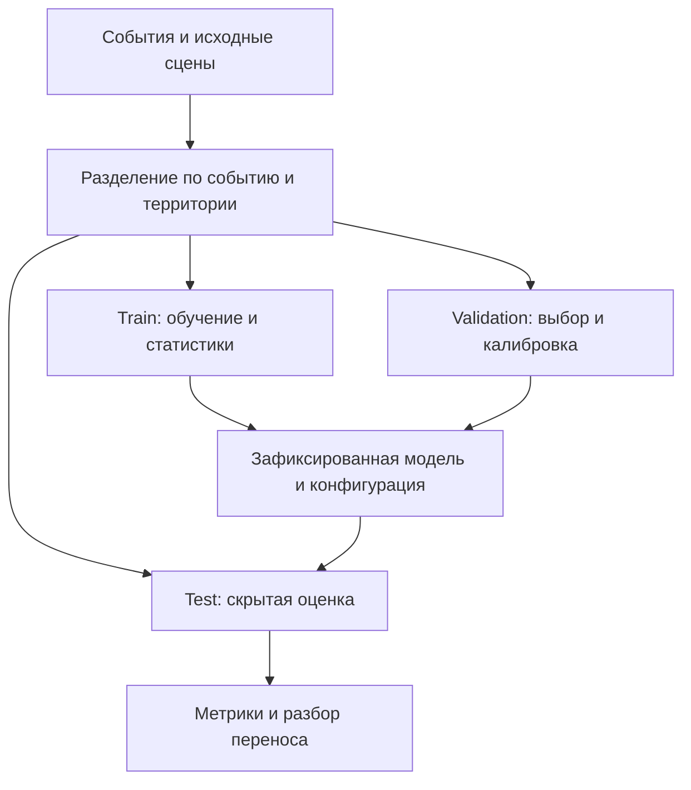

# Протокол проверки

## До обучения

Сохраните версию архива и хеши. Проверьте уникальность event/chip/scene/asset/candidate ID, отсутствие пересечения событий и регионов между split, родительские сцены и пространственное пересечение окон. Статистики, портфель и коэффициенты не должны зависеть от скрытых меток или текущих предсказаний. Автоматическая проверка идентификаторов не исключает пересечение геометрий: нужен отдельный пространственный аудит.

Стрелки из test обратно к настройке отсутствуют намеренно. Если после оценки меняется решение, это уже новый эксперимент; повторный test не превращается в независимую проверку.

## Сегментация

Используйте одну область valid pixels для baseline и основной модели. Нельзя сравнивать baseline на подвыборке с сетью на всех пикселях, не пересчитав общий знаменатель. Для каждой метрики сохраните TP, FP, FN и число валидных наблюдений по событию.

$$
IoU=\frac{TP}{TP+FP+FN},\quad
F1=\frac{2TP}{2TP+FP+FN},\quad
Precision=\frac{TP}{TP+FP},\quad
Recall=\frac{TP}{TP+FN}.
$$

Нулевой знаменатель обозначается `null` с объяснением и числом таких случаев. Не превращайте отсутствие паводковой воды во всех классах в произвольную идеальную метрику. Покажите среднее по событиям (каждое событие имеет равный вес) и/или объединенный результат с явной схемой взвешивания; не смешивайте средний IoU фрагментов с IoU общей мозаики.

Вероятностная проверка включает калибровку и качество вне одного порога. Полезны Brier score, reliability diagram, precision–recall curve; конкретный набор свободен, если выполняет критерии. Порог выбирается на validation и применяется неизменно к test.

## Неопределенность и перенос

Проверьте, чаще ли ошибается модель в областях высокого выбранного показателя неопределенности. Укажите число пикселей/объектов и зависимость между ними. При построении интервалов качества случайная выборка отдельных соседних пикселей обычно недооценивает зависимость; рассмотрите блоки или события и назовите ограничения малого числа событий.

Сравните события и условия: сезон, рельеф, тип поверхности, отсутствие S2, долю валидного наблюдения. Выполните S1-only проверку на той же области, где сравнивается полная модель. Не объясняйте снижение качества «другим регионом» без анализа данных.

## Экономика и закупка

Проверяемые вопросы:

- Сходится ли базовый EL с p × V × q при объявленной агрегации?
- Не посчитаны ли одновременно актив и ячейка, представляющая то же имущество?
- Показаны ли неоцененные активы отдельно?
- Представляет ли каждая зона один валидный полигон без holes площадью не менее 1 км² до округления?
- Совпадает ли оплачиваемая площадь с фактическим контуром, а не его прямоугольником?
- Пересчитана ли скидка для всей корзины?
- Все ли заказы существуют в каталоге и доступны до срока?
- Посчитана ли полезная площадь/экспозиция по объединению, а не сумме пересечений?
- Разделены ли измеренный результат, синтетический контроль и сценарий после покупки?
- Используют ли A/B/C одинаковые входы цены и последствий?

`python -m tools.validate_submission` проверяет машиночитаемую часть. Он не подтверждает правомерность тарифа конкретного поставщика, отсутствие утечки в обучении, корректность геометрического покрытия или фактическую полезность продукта. Эти стороны требуют содержательной проверки.

## Что показать в результатах

Таблица метрик baseline/основной модели по событиям; примеры FP/FN на карте; график калибровки; оценка ошибки ущерба с источником контрольных значений; сравнение трех стратегий; график/таблица чувствительности; журнал среды и времени выполнения. Это состав доказательств, а не обязательный дизайн панели или презентации.
