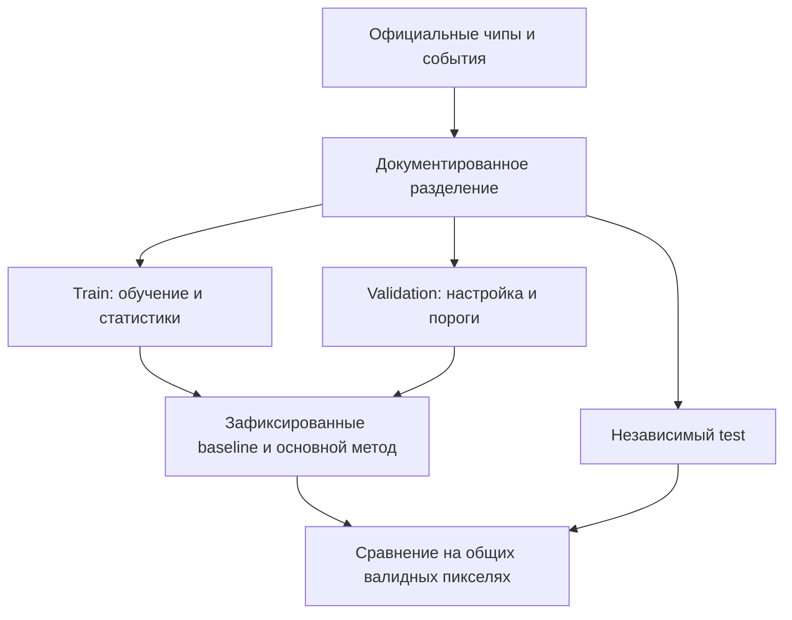

# Самопроверка проекта

Здесь собраны проверяемые условия постановки и критериев. Код проверок команда разрабатывает и публикует в GitVerse. Проверка самого справочника в GitHub Actions не оценивает решения участников.

## Независимый эксперимент

Сохраните списки, seed и код разбиения. Пересечения событий и соседних окон исключаются либо явно учитываются и обосновываются. Можно использовать опубликованный split авторов с точной версией и описанием ограничений. Открытые метки test нужны для повторения проверки, но не для выбора модели, порога или гиперпараметров.

Если после просмотра test меняется конфигурация, нужна новая независимая проверка. Перенос на новое событие/регион проверяется, если данные позволяют; невозможность такой проверки прямо указывается.

## Что подтверждают результаты

| Часть | Проверяемое содержание |
|---|---|
| Данные | VV/VH, CRS, transform, nodata, согласование с ручными метками; даты и происхождение дополнительных источников |
| Два метода | Пороговый baseline и самостоятельный основной метод; одни данные, метки и валидные пиксели итогового сравнения |
| Метрики | IoU, F1/Dice, Precision, Recall и число пикселей; различия по событиям/участкам, пропуски и ложные срабатывания |
| Эксперимент | Хотя бы один контролируемый опыт без настройки на test; при дополнительных данных — S1-only и расширенный вариант |
| Вероятности | Способ получения, проверка надежности, при необходимости калибровка на train/validation |
| Неопределенность | Определение, единицы, связь с ошибками/нестабильностью и влияние на объекты, ущерб или заказ |
| Растры | Float32 p с nodata −9999; UInt8 mask с nodata 255; сетка исходного S1; на валидных пикселях mask = (p ≥ threshold) |
| Портфель | Ровно 10 Point заданных типов и V/q; случайное размещение по S1 с seed без прогнозов и ручных тестовых меток; совпадение CSV и GeoJSON |
| Ущерб | p из исходного растра основного метода, EL = pVq независимо от порога; все объекты и статусы; rank по убыванию EL, при равенстве по asset_id |
| Геометрия | Собственные уникальные candidate_id, Polygon без holes, площадь ≥ 1 км² до округления и площадь по контуру |
| Стоимость | Раскрытые условия заказа и коэффициенты, пересчет скидки отдельно для всей корзины B/C, округление и проверка суммы |
| Стратегии | Одна карта, один портфель и каталог; A без платных заказов; C соблюдает лимит; B сверх бюджета подписана как контрфактическая |
| Покрытие | Только уникальные оцененные объекты в пригодных к сроку зонах текущего наблюдения; контекстный архив не считается текущей водой |
| Эффект | Исходная неопределенность A со статусом baseline; для B/C — обоснованный scenario, measured либо not_estimated с пустым числом |
| Чувствительность | Ущерб к p, V, q по отдельности; план как минимум к бюджету и одному экономическому параметру |
| Сдача | Все обязательные файлы без NaN/Inf, согласованные ID/координаты/суммы; интерфейс, код и модели/веса в GitVerse; воспроизводимые команды |

Неопределенная метрика с нулевым знаменателем требует пояснения. Отсутствующая оценка не заменяется нулем. Имена файлов метрик baseline/основного метода свободны; ссылки на них сохраняются в паспорте запуска.

## Прокси-проверка ущерба

На независимых валидных ручных метках сопоставьте pVq и yVq при одних фиксированных учебных V/q. Раскройте выбор контрольных точек, число оцененных точек и показатель ошибки; точки не выбираются по прогнозу. Это проверка модельного прокси, а не измерение реальных потерь.

Если на демонстрационном чипе или в местах десяти объектов нет пригодных независимых меток, используйте отдельный размеченный test-чип без настройки по нему. Он не заменяет демонстрационный портфель. При отсутствии подходящих ручных меток прямо укажите, что прокси-ошибка не проверена. Протокол и результат сохраняются в отчете и `run_metadata.json`.

## Проверка на защите

По README жюри должно суметь повторить заявленные этапы, запустить обучение, применить сохраненный метод к другому официальному S1-чипу и изменить бюджет в интерфейсе. После изменения бюджета прогноз, пороги и исходный портфель остаются теми же. Для нового комплекта результатов явно обозначается версия.

[Форматы](CONTRACTS.md) · [Критерии](EVALUATION.md)
